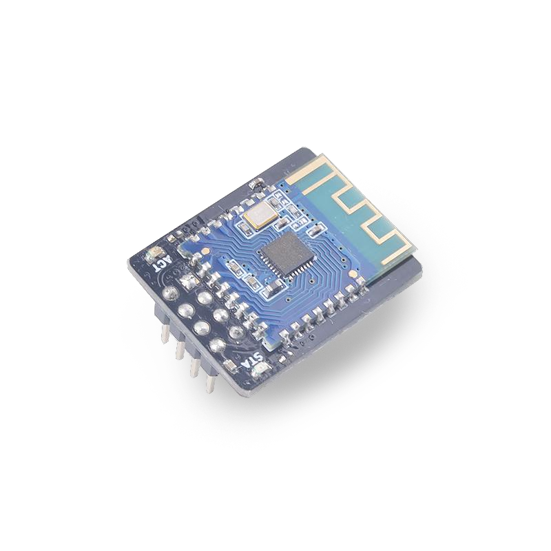

# SP_BT模块使用说明

## 介绍

SP_BT是一款蓝牙串口透传模块，具备超低功率特性和高可靠性。

* 蓝牙版本：支持 BLE 5.0（兼容BLE4.0、BLE4.2）

* 默认串口波特率：9600

  

  *详细特性参考 [SP-BT 规格书 V1.0.pdf](doc/SP-BT 规格书 V1.0.pdf)*

## 接线方式

|   MCU    | SP_BT |
| :------: | :---: |
|   TXD    |  RXD  |
|   RXD    |  TXD  |
| 1.8-3.3V | 3.3V  |
|   GND    |  GND  |

## MCU端口配置

### IO口配置

将原理图对应的IO口配置为串口收发功能号

* C示例

  ```c
  fpioa_set_function(6, FUNC_UART1_RX);
  fpioa_set_function(7, FUNC_UART1_TX);
  ```

* MaixPy示例

  ```python
  fm.register(6,fm.fpioa.UART1_RX)
  fm.register(7,fm.fpioa.UART1_TX)
  ```

### UART初始化

UART初始化波特率必须与SP_BT波特率一致，可以使用AT指令改变SP_BT的波特率，这里默认为9600

* C示例

  ```c
  uart_init(UART_DEVICE_1);
  uart_configure(UART_DEVICE_1, 9600, 8, UART_STOP_1, UART_PARITY_NONE);
  ```

* MaixPy示例

  ```python
  uart = UART(UART.UART1,9600,8,1,0,timeout=1000, read_buf_len=4096)
  ```

## SP_BT配置

### AT指令列表

|       指令        |               功能                |
| :---------------: | :-------------------------------: |
| AT+BAUD\<Param\>  | 波特率（0-6）分别代表不同的波特率 |
| AT+NAME\<Param\>  |              广播名               |
| AT+SLEEP\<param\> |               睡眠                |

*更多AT指令请参考[JDY-23 手册](doc/JDY-23-V2.1.pdf)*

### AT指令使用

* 流程
  1. 发送AT指令
  2. 接收数据
  3. 判断是否设置成功

* C示例

  ```c
  //set the name of sp_bt module to MAIXCUBE
  uart_send_data(UART_NUM, "AT+NAMEMAIXCUBE\r\n", strlen("AT+NAMEMAIXCUBE\r\n")); //send AT order
  msleep(100);
  ret = uart_receive_data(UART_NUM, rcv_buf, sizeof(rcv_buf)); //receive response
  if(ret != 0 && strstr(rcv_buf, "OK"))
  {
     printk(LOG_COLOR_W "set name success!\r\n");
  }
  
  // get the name of sp_bt module
  uart_send_data(UART_NUM, "AT+NAME\r\n", strlen("AT+NAME\r\n")); //send AT order
  msleep(100);
  ret = uart_receive_data(UART_NUM, rcv_buf, sizeof(rcv_buf)); //receive response
  if(ret != 0 && strstr(rcv_buf, "NAME"))
  {
     printk(LOG_COLOR_W "get name success!\r\n");
  }
  ```

* MaixPy示例

  ```python
  #set the name of sp_bt module to MAIXCUBE
  uart.write("AT+NAMEMAIXCUBE\r\n") #send AT order
  time.sleep_ms(100)
  read_data = uart.read() #receive response
  if read_data:
      read_str = read_data.decode('utf-8')
      count = read_str.count("OK")
      if count != 0:
          uart.write("set name success\r\n")
  
  # get the name of sp_bt module
  uart.write("AT+NAME\r\n") #send AT order
  time.sleep_ms(100)
  read_data = uart.read() #receive response
  if read_data:
      read_str = read_data.decode('utf-8')
      count = read_str.count("NAME")
      if count != 0:
          uart.write("get name success\r\n")
  ```

*注意发送AT指令后一定要加上\r\n*

