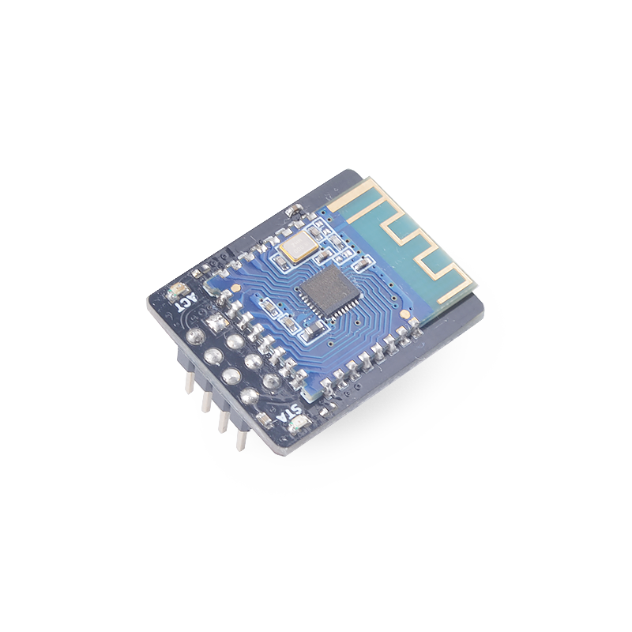

# SP_BT  Module User Guide

[中文](README_CN.md)

## Directory Structure
| Directory | Description                                   |
| :-------: | :-------------------------------------------- |
|    doc    | Reference documentation                       |
|    img    | Images                                        |
|  script   | Maixpy script example                         |
|    src    | C program example based on the standalone sdk |

## Module Introduce

SP_BT is a Bluetooth serial transmission module with ultra-low power and high reliability.

* Bluetooth version：Support BLE 5.0 (compatible with BLE4.0, BLE4.2)

* Default Baud Rate：9600

  

  *See [Specification](doc/SP-BT规格书V1.0.pdf) for more information*

## Mode of connection


|  MCU:FUN(IO)   | SP_BT |
| :------------: | :---: |
| UART:TXD(IO_7) |  RXD  |
| USRT:RXD(IO_6) |  TXD  |
|    1.8-3.3V    | 3.3V  |
|      GND       |  GND  |

## Pin figure


## MCU configuration

### IO port configuration

Configure IO port corresponding to MCU as UART function pin.

* C

  ```c
  // set uart rx/tx func to io_6/7
  fpioa_set_function(6, FUNC_UART1_RX + UART_NUM * 2);
  fpioa_set_function(7, FUNC_UART1_TX + UART_NUM * 2);
  ```

* MaixPy

  ```python
  # set uart rx/tx func to io_6/7
  fm.register(6,fm.fpioa.UART1_RX)
  fm.register(7,fm.fpioa.UART1_TX)
  ```

### UART  initialization

The UART initialization baud rate must be consistent with the SP_BT baud rate. The AT instruction can be used to change the Baud rate of SP_BT, which defaults to 9600.

* C

  ```c
  uart_init(UART_DEVICE_1);
  uart_configure(UART_DEVICE_1, 9600, 8, UART_STOP_1, UART_PARITY_NONE);
  ```

* MaixPy

  ```python
  uart = UART(UART.UART1,9600,8,1,0,timeout=1000, read_buf_len=4096)
  ```

## SP_BT  configuration

### AT instruction list

|       Order       |                   Description                   |
| :---------------: | :---------------------------------------------: |
| AT+BAUD\<Param\>  | Baud rates (0-6 represent different baud rates) |
| AT+NAME\<Param\>  |                 Boardcast name                  |
| AT+SLEEP\<param\> |                      Sleep                      |

*See [JDY-23-V2.1.pdf](doc/JDY-23-V2.1.pdf) for more information*

### AT  instruction usage

* Process
  1. Send AT instruction
  2. Receive the reply
  3. Determines whether the setup was successful

* C

  ```c
  //change the name of sp_bt module to MAIXCUBE
  uart_send_data(UART_NUM, "AT+NAMEMAIXCUBE\r\n", strlen("AT+NAMEMAIXCUBE\r\n")); //send AT order
  msleep(100);
  ret = uart_receive_data(UART_NUM, rcv_buf, sizeof(rcv_buf)); //receive response
  if(ret != 0 && strstr(rcv_buf, "OK"))
  {
     printk(LOG_COLOR_W "set name success!\r\n");
  }
  
  // get the name of sp_bt module
  uart_send_data(UART_NUM, "AT+NAME\r\n", strlen("AT+NAME\r\n")); //send AT order
  msleep(100);
  ret = uart_receive_data(UART_NUM, rcv_buf, sizeof(rcv_buf)); //receive response
  if(ret != 0 && strstr(rcv_buf, "NAME"))
  {
     printk(LOG_COLOR_W "get name success!\r\n");
  }
  ```

* MaixPy

  ```python
  #change the name of sp_bt module to MAIXCUBE
  uart.write("AT+NAMEMAIXCUBE\r\n") #send AT order
  time.sleep_ms(100)
  read_data = uart.read() #receive response
  if read_data:
      read_str = read_data.decode('utf-8')
      count = read_str.count("OK")
      if count != 0:
          uart.write("set name success\r\n")
  
  # get the name of sp_bt module
  uart.write("AT+NAME\r\n") #send AT order
  time.sleep_ms(100)
  read_data = uart.read() #receive response
  if read_data:
      read_str = read_data.decode('utf-8')
      count = read_str.count("NAME")
      if count != 0:
          uart.write("get name success\r\n")
  ```

*Note that you must add \r\n after sending AT instruction*

## Result

<center class="third">
	
</center>

## Runtime environments

| Language |  Board   |      SDK/Firmware version      |
| :------: | :------: | :----------------------------: |
|    C     | MaixCube | kendryte-standalone-sdk v0.5.6 |
|  MaixPy  | MaixCube |         maixpy v0.5.1          |

## LICENSE

See [LICENSE](LICENSE.md) fil.

## Othre information

| Version |   Editor   |
| :-----: | :--------: |
|  v0.1   | vamoosebbf |

